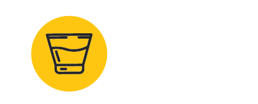
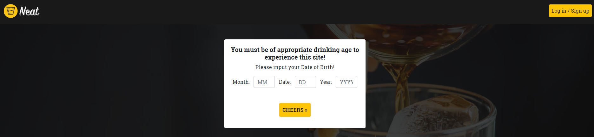
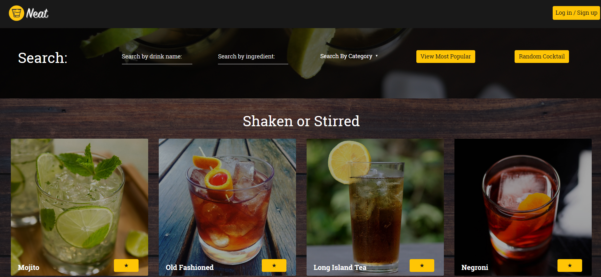
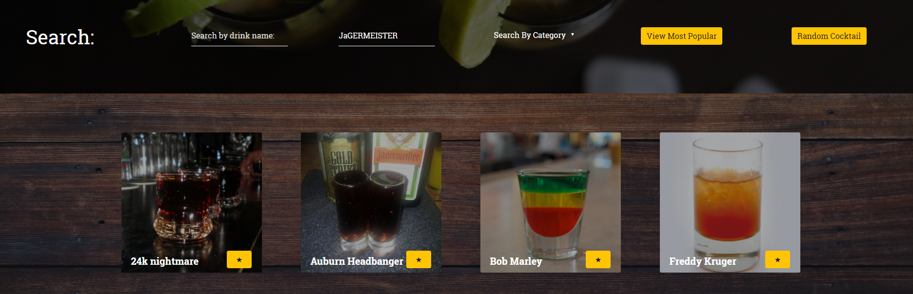
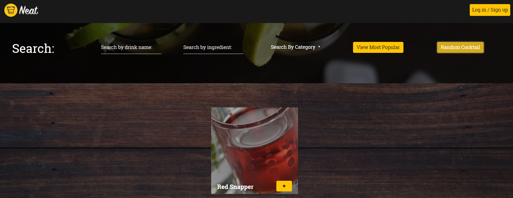
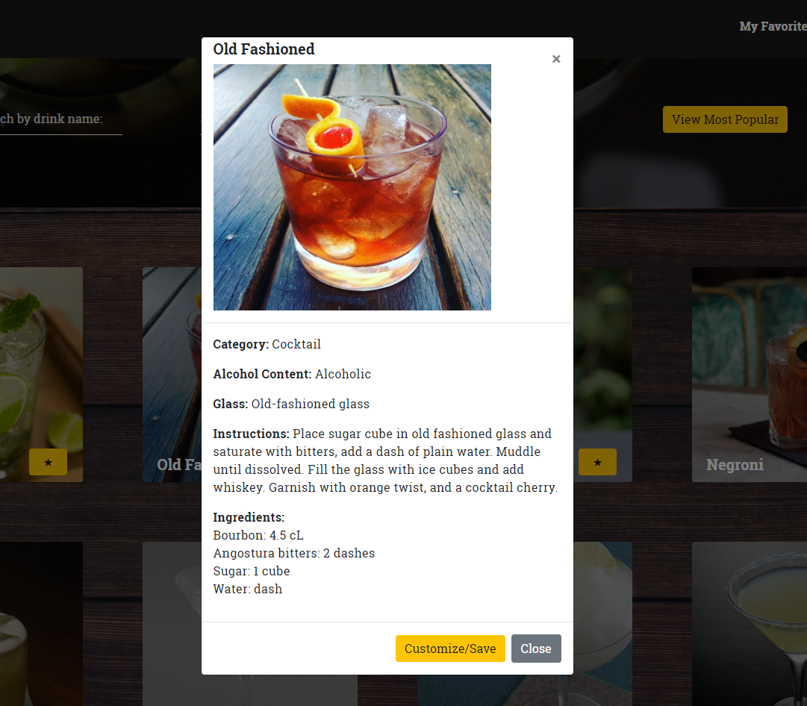
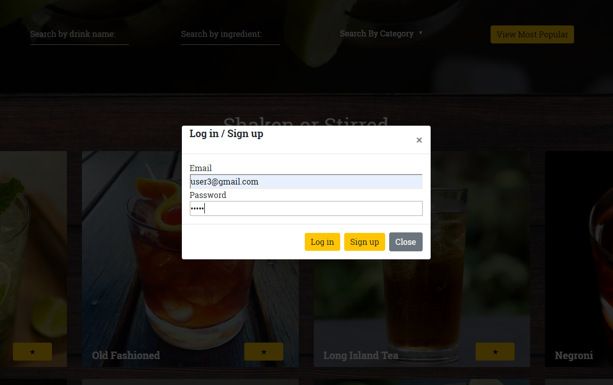
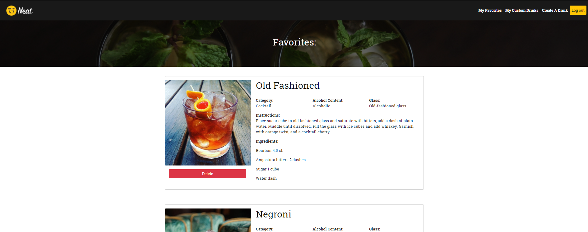
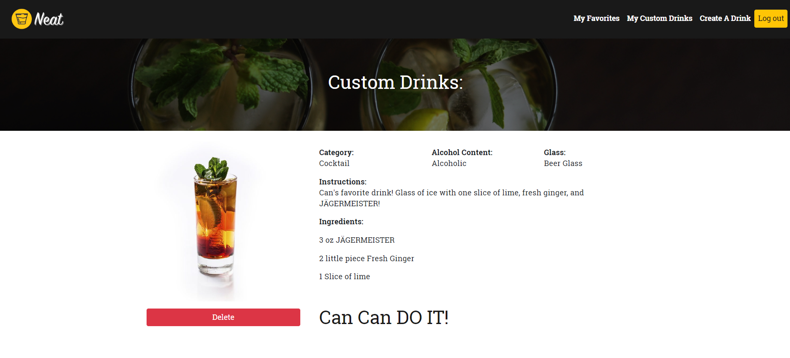
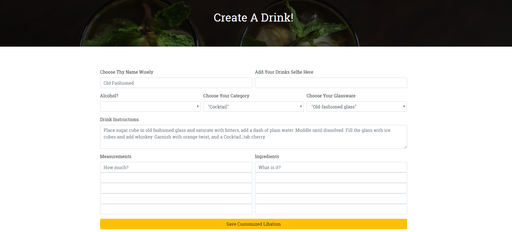

# NEAT UP!

<a href="https://project-neat.herokuapp.com/">NEAT</a>

Are you thirsty? Can't decide what to drink? Want to find new cocktail recipes? 

Be ready to **Neat your mind up!**

**NEAT** is simple cocktail creation and search web project. This project will help the client to find randomize drink, most favorite drink on cocktailDB and show how to make them and ingredients. Also client can add cocktails into their favorite section. Maybe they need to make it later! Maybe client is bartender or like unordinary drinks or has really creative mind to make their or special drink. **NEAT UP** help them to create new drink!

Web page starts with age validation. If client is under 21 they cannot enter the web site. 

After passing age validation **NEAT** index page will show most popular and most known 15 drink to client. Such as mojito, old fashion...

If you know what you want, but you don't know how to make it, there is a search section! Clients can search from name or ingredients. And save it as favorite or customize them.

Are you open to new tastes? Do you like gambling? Randomize function is for you! There is a randomize button. If clients click it it will show a random cocktail.

If the client clicks one of the drinks a modal is shown with drink information. At this point, clients may want to add it as their favorite or create new one inspired from this cocktail! It is easy with **NEAT**.

Every client is precious for us. We want to keep their favorites and custom drinks. If clients want to add one drink as favorite or create one, the web site will prompt to log in. If user has not signed in yet, they have to sign in first. 

After log-in users can see "My Favorites" , "My Custom Drinks" , "Create A Drink" selections. They can easily reach their lists and create new drink.

If they try one drink and they don't like it. No worries! There is a delete button. Clients can delete it easily.

You know better! You know how to Shake it up! So another one! There is a create feature to create your own drink. After clicking create drink, client can see empty input sections. After filling your drink you can save your drink in your profile page. Or you can push customize one. It's up to you!

**Project is created by** 

**Front-End**

- Shannon Johnson: https://github.com/clearplaid

- Corey Thomas   : https://github.com/ctashton

**Back-End**

- Ryan Birch: https://github.com/RyanBirch

- Şahin Can Barış : https://github.com/SCbaris

Our application used 
- HTML 5.
- CSS 3.
- Bootstrap frameworks to make website mobile responsive.
- Express/handlebars to route our site pages more .functional.
- Node external modules Express, Seaquelize to sending and taking datas from database.
- MySQL database.
- Node external modules Passport and Bcryptjs to create user passwords and user informations.
- Axios to taking randomize drink and search.
- Node.js and core node modules to creating code.

Next Features
Socialization
	- Make Friends
	- View/Like/Share/Comment Drinks
	- Track favorites count
	- Schedule “NeatUps”
Future Fun Features
Gamify
	-Earn badges for making libations
Educate
	-Take quizzes on drink ingredients
